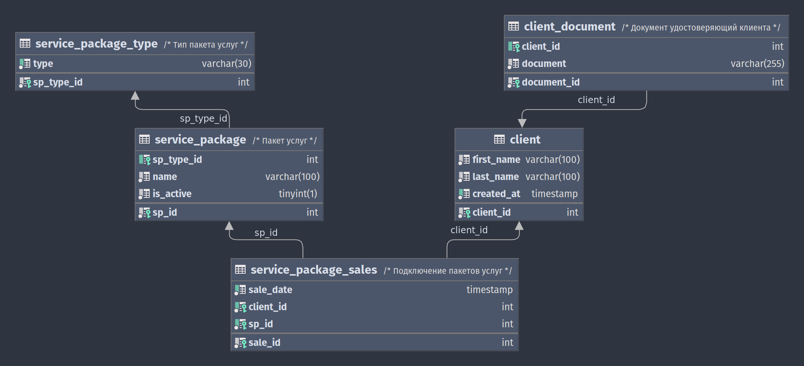

# Тестовое задание по SQL

---
Задание выполнялось на MySQL Ver 8.0.29-0<br>
[Полный <code>*.sql</code> файл с решениями](https://github.com/kharlamarla/SQL-test-task/blob/main/console.sql)

## Задание №1

### Вводные:

> Абоненты компании могут подключить пакеты. Пакеты могут быть разных типов:
> голосовые, интернет и смс.
> Один абонент может подключить любое кол-во и любое сочетание пакетов,
> несколько раз в месяц (либо вообще ничего не подключить).
> В системе фиксируется ID абонента, ID пакета, тип пакета, дата и факт
> подключения пакета абонентом

### Задание:

> 1. Нарисовать возможную схему таблиц для хранения этой информации.
     Написать по этой базе данных SQL запросы:

Исходя из вводных данных, используются связи один-к-одному и один-ко-многим.
Диаграмма из DataGrip:



> 2. Вывести тип пакета, которого подключено больше всего на текущую дату

```mysql
SELECT
    spt.type,
    COUNT(sp.sp_type_id) AS 'count'
  FROM service_package_sales         sps
           JOIN service_package      sp
                ON sps.sp_id = sp.sp_id
           JOIN service_package_type spt
                ON sp.sp_type_id = spt.sp_type_id
 GROUP BY spt.type
 ORDER BY count DESC
 LIMIT 1;
```

> 3. Вывести топ 20 пакетов, которые чаще всего подключают (помесячно,
     за последние 3 месяца)

```mysql
  WITH last_3month_sales AS (
    SELECT
        MONTH(sps.sale_date)             AS month_num,
        DATE_FORMAT(sps.sale_date, '%M') AS month_name,
        sps.sp_id,
        COUNT(*)                         AS sale_count,
        RANK() OVER (
            PARTITION BY MONTH(sps.sale_date)
            ORDER BY COUNT(*) DESC
            )                            AS sales_rank,
        ROW_NUMBER() OVER (
            PARTITION BY MONTH(sps.sale_date)
            ORDER BY COUNT(*) DESC
            )                            AS row_num
      FROM service_package_sales sps
     WHERE MONTH(sps.sale_date)
         BETWEEN MONTH(CURRENT_DATE - INTERVAL 3 MONTH)
         AND MONTH(CURRENT_DATE - INTERVAL 1 MONTH)
     GROUP BY MONTH(sps.sale_date),
         DATE_FORMAT(sps.sale_date, '%M'),
         sps.sp_id
     ORDER BY month_num,
         month_name,
         row_num,
         sales_rank)
SELECT
    l3ms.month_name,
    sp.name,
    l3ms.sale_count
--    l3ms.sales_rank,
--    l3ms.row_num
  FROM last_3month_sales             l3ms
           LEFT JOIN service_package sp
                     ON sp.sp_id = l3ms.sp_id
-- Строгий ТОП20 по кол-ву
 WHERE row_num <= 20;
-- Топ 20 по рангу
-- WHERE l3ms.sales_rank <= 20;
```

> 4. Вывести список пакетов, которые никогда не подключались.

```mysql
SELECT
    sp.name
  FROM service_package sp
 WHERE sp.sp_id NOT IN (
     SELECT DISTINCT sps.sp_id
       FROM service_package_sales sps);
```

> 5. Вывести список пакетов, которые были подключены в марте этого года, но
     ни разу не подключались в апреле этого года.

```mysql
SELECT
    sp.name
  FROM service_package_sales         sps
           LEFT JOIN service_package sp
                     ON sp.sp_id = sps.sp_id
 WHERE MONTH(sps.sale_date) = 3
   AND sps.sp_id NOT IN (
     SELECT DISTINCT
         sps_2.sp_id
       FROM service_package_sales sps_2
      WHERE MONTH(sps_2.sale_date) = 4);
```

> 6. По каждому типу пакета вывести top 20 пользователей, которые подключили
     больше всего пакетов из этой группы за последний месяц.

```mysql
  WITH top20_clients AS
    (
        SELECT
            spt.sp_type_id,
            sps.client_id,
            COUNT(*) AS sale_count,
            RANK() OVER (
                PARTITION BY spt.sp_type_id
                ORDER BY spt.sp_type_id, COUNT(*) DESC
                )    AS client_rank,
            ROW_NUMBER() OVER (
                PARTITION BY spt.sp_type_id
                ORDER BY spt.sp_type_id, COUNT(*) DESC
                )    AS row_num
          FROM service_package_sales         sps
                   JOIN service_package      sp
                        ON sp.sp_id = sps.sp_id
                   JOIN service_package_type spt
                        ON spt.sp_type_id = sp.sp_type_id
         WHERE MONTH(sps.sale_date) = MONTH(CURRENT_DATE - INTERVAL 1 MONTH)
         GROUP BY spt.sp_type_id,
             sps.client_id
         ORDER BY spt.sp_type_id,
             client_rank,
             row_num,
             sale_count DESC,
             sps.client_id)
SELECT
    spt.type,
    CONCAT_WS(' ', c.first_name, c.last_name) AS client_name,
    tc.sale_count,
    tc.client_rank,
    tc.row_num
  FROM top20_clients                      tc
           LEFT JOIN service_package_type spt
                     USING (sp_type_id)
           LEFT JOIN client               c
                     USING (client_id)
-- Строго топ20 по кол-ву
 WHERE tc.row_num <= 20;
-- Топ20 по рангу
-- WHERE tc.client_rank <= 20;
```

---

## Задание №2

> Есть таблица следующей структуры (+ приведен пример заполнения):
> <table>
>     <tr><th> ID (int) </th><th> T (varchar) </th></tr>
>     <tr><td>1</td><td>abc</td></tr>
>     <tr><td>2</td><td>bca</td></tr>
>     <tr><td>3</td><td>adfrq</td></tr>
>     <tr><td>4</td><td>bca</td></tr>
>     <tr><td>5</td><td>abcd</td></tr>
>     <tr><td>...</td><td>...</td></tr>
> </table>
>
> В текстовом поле Т есть дубли, которые надо удалить из таблицы.
> Напишите запрос для их удаления (удалить надо только дублирующую строку, т.е.
> одно значение оставить)

### Решение:

*В отличии от PostgreSQL, в MySQL нет DISTINCT ON (), поэтому выбрана
следующая реализация*

```mysql
-- в отличии от Postgres, в MySQL нет DISTINCT ON (), поэтому реализация
-- следующая:
  WITH counted_rows        AS (
      SELECT
          std.id,
          std.st,
          ROW_NUMBER() OVER (
              PARTITION BY std.st
              ORDER BY std.st, std.id
              ) AS count_values
        FROM sample_text_duplicates std
       ORDER BY std.st,
           std.id),
      duplicated_values_id AS (
          SELECT
              cr.id
            FROM counted_rows cr
           WHERE cr.count_values > 1)
DELETE
  FROM sample_text_duplicates std
 WHERE std.id IN (
     SELECT *
       FROM duplicated_values_id);
```

